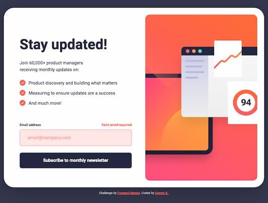
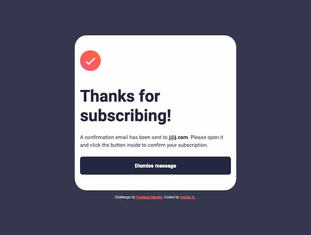
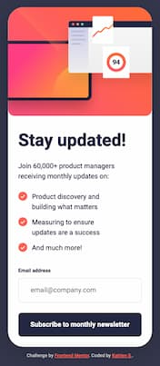

# Frontend Mentor - Newsletter sign-up form with success message solution

This is a solution to the [Newsletter sign-up form with success message challenge on Frontend Mentor](https://www.frontendmentor.io/challenges/newsletter-signup-form-with-success-message-3FC1AZbNrv). Frontend Mentor challenges help you improve your coding skills by building realistic projects.

## Table of contents

- [Overview](#overview)
  - [The challenge](#the-challenge)
  - [Screenshot](#screenshot)
  - [Links](#links)
- [My process](#my-process)
  - [Built with](#built-with)
  - [What I learned](#what-i-learned)
  - [Continued development](#continued-development)
  - [Useful resources](#useful-resources)
- [Author](#author)

**Note: Delete this note and update the table of contents based on what sections you keep.**

## Overview

### The challenge

Users should be able to:

- Add their email and submit the form
- See a success message with their email after successfully submitting the form
- See form validation messages if:
  - The field is left empty
  - The email address is not formatted correctly
- View the optimal layout for the interface depending on their device's screen size
- See hover and focus states for all interactive elements on the page

### Screenshot

### Links

- Solution URL: [Github](https://github.com/graficdoctor/fe-23-002-newsletter-sign-up-with-success-message)
- Live Site URL: [Vercel](https://fe-23-002-newsletter-sign-up-with-success-message.vercel.app/)

## My process

### Built with

- Semantic HTML5 markup
- CSS custom properties
- Flexbox
- CSS Grid
- Mobile-first workflow

### What I learned

I learned how to implement form validation.

### Continued development

I suppose I still could finetune the email-validation. As it is the first time I successfully implement it.

### Useful resources

- [SVG icon as list item bullets](https://brickslabs.com/how-to-add-svg-icon-as-list-item-bullets/) - I took this code to add the svg icons as list item bullets.
- [How to Validate Email in HTML CSS & JavaScript](https://www.codingnepalweb.com/create-email-checker-javascript/)

## Author

- Website - [Katrien S.](https://www.katriens.be)
- Frontend Mentor - [@graficdoctor](https://www.frontendmentor.io/profile/graficdoctor)
- Twitter - [@graficdoctor](https://www.twitter.com/graficdoctor)
